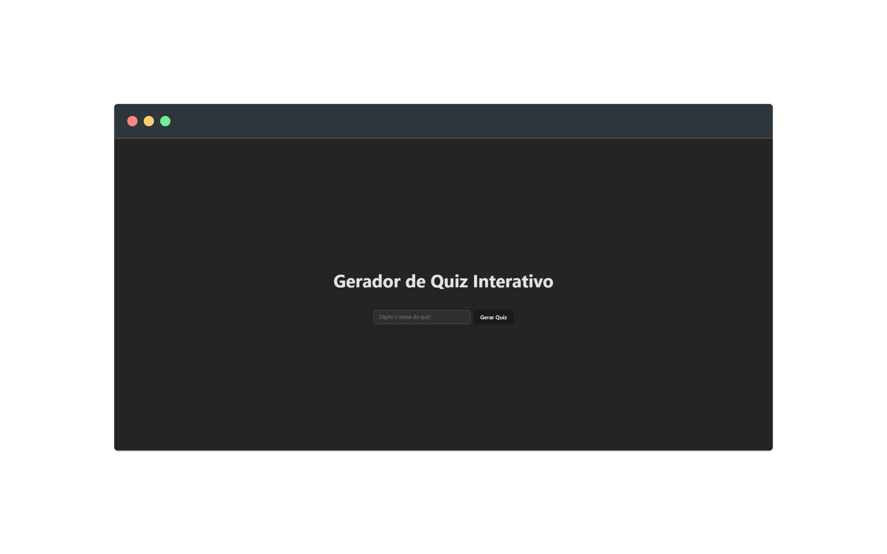
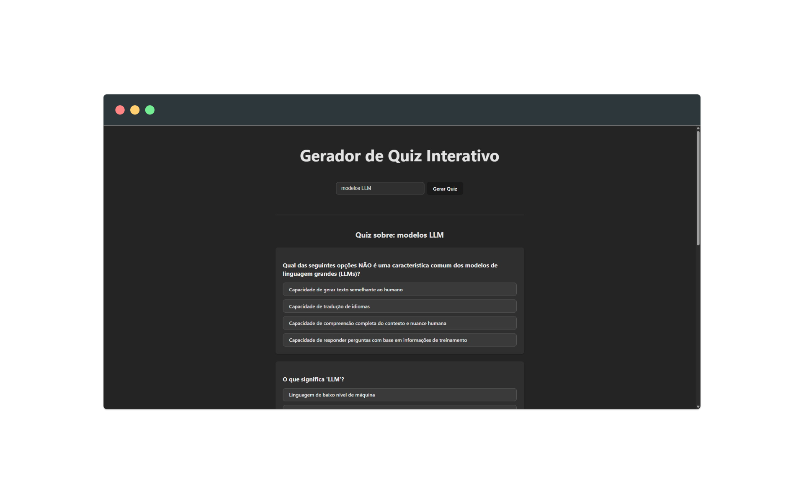

# AI Quiz Generator - Aplicação Interativa


## 📋 Visão Geral

Este projeto é um **Gerador de Quiz Interativo** que utiliza inteligência artificial para criar perguntas de múltipla escolha sobre qualquer tema escolhido pelo usuário. A aplicação demonstra a integração eficiente entre React moderno e APIs de LLM (Large Language Models), oferecendo uma experiência educativa e interativa.

### 🎨 Preview da Aplicação

|  |  |
|:----------------------------------------------:|:------------------------------------------------:|
| **Interface de Entrada**                       | **Quiz Interativo**                             |

## 🚀 Funcionalidades

- **Geração Inteligente de Conteúdo**: Criação automática de 5 perguntas de múltipla escolha sobre qualquer tema usando Google Gemini AI
- **Interface Interativa**: Sistema de quiz com feedback visual imediato após cada resposta
- **Validação de Respostas**: Destaque automático das respostas corretas e incorretas
- **Tratamento de Erros**: Sistema de validação de dados e tratamento de exceções
- **Experiência Responsiva**: Interface adaptável para diferentes tamanhos de tela
- **Estados de Loading**: Feedback visual durante a geração de conteúdo
- **Parsing Inteligente**: Processamento das respostas da API com limpeza automática de formatação
- **Prevenção de Interação**: Bloqueio de respostas após seleção para manter integridade do quiz

## 💻 Tecnologias e Ferramentas

### Front-end
- **React 19**: Utilização da versão mais recente com hooks modernos
- **JavaScript ES6+**: Desenvolvimento com recursos avançados da linguagem
- **Vite**: Build tool otimizada para desenvolvimento rápido

### Inteligência Artificial
- **Google Gemini AI (Gemini-1.5-Flash)**: Modelo LLM principal para geração de conteúdo
- **OpenAI API**: Configuração preparada para alternativas de IA
- **Prompt Engineering**: Prompts otimizados para geração consistente de quizzes

### Otimizações e Padrões
- **Error Boundaries**: Tratamento elegante de erros de componentes
- **State Management**: Gerenciamento eficiente de estado com React Hooks
- **Performance**: Otimizações para renderização e manipulação de dados
- **Code Splitting**: Estrutura modular para melhor manutenibilidade

## 🧠 Arquitetura e Estrutura

### Organização de Componentes

```bash
src/
├── App.jsx                   # Componente principal da aplicação
├── QuizQuestion.jsx          # Componente individual de pergunta
├── App.css                   # Estilos específicos da aplicação
├── index.css                 # Estilos globais e variáveis CSS
└── main.jsx                  # Ponto de entrada da aplicação
```

### Fluxo de Dados

1. **Input do Usuário**: Tema inserido no campo de texto
2. **Processamento IA**: Envio do prompt para Google Gemini AI
3. **Validação**: Parsing e validação do JSON retornado
4. **Renderização**: Exibição das perguntas de forma interativa
5. **Interação**: Sistema de resposta com feedback visual

## 🤖 Integração com IA

### Google Gemini AI

A aplicação utiliza o modelo **Gemini-1.5-Flash** para geração de conteúdo:

```javascript
const prompt = `Gere 5 perguntas de múltipla escolha sobre ${subject}. 
Produza um JSON válido no seguinte formato EXATO:
[
  { 
    "question": "Texto da pergunta", 
    "options": ["Opção A", "Opção B", "Opção C", "Opção D"], 
    "correct": "Opção A" 
  }
]`;
```

### Características da Implementação

- **Prompt Engineering**: Prompts estruturados para resultados consistentes
- **Parsing**: Sistema de limpeza e validação de JSON
- **Fallback de Erro**: Tratamento gracioso de falhas na API
- **Rate Limiting**: Prevenção de múltiplas requisições simultâneas

## 🎯 Funcionalidades Detalhadas

### Sistema de Quiz Interativo

- **Seleção Única**: Cada pergunta permite apenas uma resposta
- **Feedback Imediato**: Cores diferenciadas para respostas corretas/incorretas
- **Estado Bloqueado**: Prevenção de mudança após resposta selecionada
- **Destaque Visual**: Realce automático da resposta correta quando usuário erra

### Validação e Segurança

- **Validação de Input**: Verificação de campos obrigatórios
- **Sanitização de Dados**: Limpeza de respostas da API
- **Validação de Estrutura**: Confirmação de formato JSON correto
- **Tratamento de Exceções**: Captura e apresentação amigável de erros

## 📱 Design Responsivo

### Adaptações por Dispositivo

- **Desktop**: Layout com maior espaçamento
- **Mobile**: Interface em coluna com elementos empilhados

### Princípios de UX/UI

- **Contraste Adequado**: Cores que garantem legibilidade
- **Feedback Visual**: Estados claros para todas as interações
- **Acessibilidade**: Estrutura semântica e foco adequado
- **Transições Suaves**: Animações que melhoram a experiência

## 🔧 Configuração e Execução

### Pré-requisitos

- Node.js (versão 18 ou superior)
- Conta no Google AI Studio para obter API Key
- npm ou yarn para gerenciamento de pacotes

### Passo a Passo

1. **Clone o repositório**:
   ```bash
   git clone [url-do-repositorio]
   cd ai_quiz
   ```

2. **Instale as dependências**:
   ```bash
   npm install
   # ou
   yarn
   ```

3. **Configure as variáveis de ambiente**:
   ```bash
   # Crie um arquivo .env na raiz do projeto
   VITE_GOOGLE_GEMINI_API_KEY=sua_api_key_aqui
   ```

4. **Inicie a aplicação**:
   ```bash
   npm run dev
   # ou
   yarn dev
   ```

5. **Acesse no navegador**:
   [http://localhost:5173](http://localhost:5173)

### Obtendo a API Key

1. Acesse [Google AI Studio](https://makersuite.google.com/app/apikey)
2. Crie uma nova API Key
3. Adicione a chave no arquivo `.env`

## 🧪 Scripts Disponíveis

- `npm run dev` - Inicia servidor de desenvolvimento com hot-reload
- `npm run build` - Gera build otimizada para produção
- `npm run lint` - Executa verificação de código com ESLint
- `npm run preview` - Serve a build de produção localmente

## 🔍 Decisões Técnicas

### Por que Google Gemini AI?

- **Performance**: Modelo Gemini-1.5-Flash oferece resposta rápida
- **Qualidade**: Geração consistente de conteúdo educativo
- **Custo-benefício**: API gratuita com limites generosos
- **Confiabilidade**: Infraestrutura robusta do Google

### Por que React 19?

- **Hooks Modernos**: Aproveitamento dos recursos mais recentes
- **Performance**: Melhorias significativas de renderização
- **Developer Experience**: Ferramentas de desenvolvimento aprimoradas

### Por que Vite?

- **Velocidade**: HMR extremamente rápido durante desenvolvimento
- **Simplicidade**: Configuração mínima necessária
- **Otimização**: Build de produção otimizada automaticamente

## 🎓 Aprendizados e Demonstrações

### Habilidades Demonstradas

- **Integração com APIs de IA**: Implementação eficiente de LLMs
- **Processamento de Dados**: Parsing e validação de JSON complexo
- **Estado Complexo**: Gerenciamento de múltiplos estados da aplicação
- **Error Handling**: Tratamento robusto de exceções
- **UX/UI Design**: Interface intuitiva e responsiva
- **React Moderno**: Uso de hooks e padrões atuais

### Challenges Superados

- **Inconsistência de API**: Tratamento de variações no formato de resposta
- **Rate Limiting**: Implementação de controles de requisição
- **Parsing Robusto**: Limpeza automática de markdown e formatação
- **Estado de Loading**: Feedback visual durante operações assíncronas

## 📝 Sobre o Desenvolvedor

Esta aplicação foi desenvolvida para demonstrar competências em:

- **Frontend Moderno**: React 19, JavaScript ES6+, CSS moderno
- **Integração de IA**: APIs de LLM, prompt engineering
- **UX/UI Design**: Interfaces responsivas e acessíveis
- **Arquitetura**: Código limpo, modular e manutenível
- **Problem Solving**: Soluções criativas para desafios técnicos

---

### 🌐 Contato

- 🌐 [GitHub](https://github.com/andersonssantana/)
- 👔 [LinkedIn](https://www.linkedin.com/in/andersonssantana/)
- ✉️ [E-mail](mailto:anderssantana@outlook.com)

---

Desenvolvido com 🤖, ⚛️ e 💡 - Demonstrando a fusão entre React moderno e Inteligência Artificial